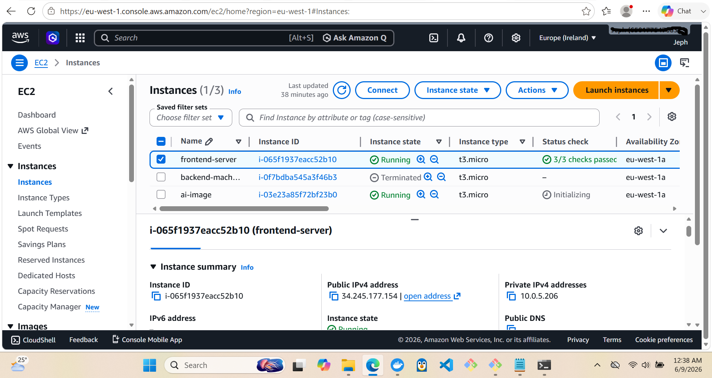
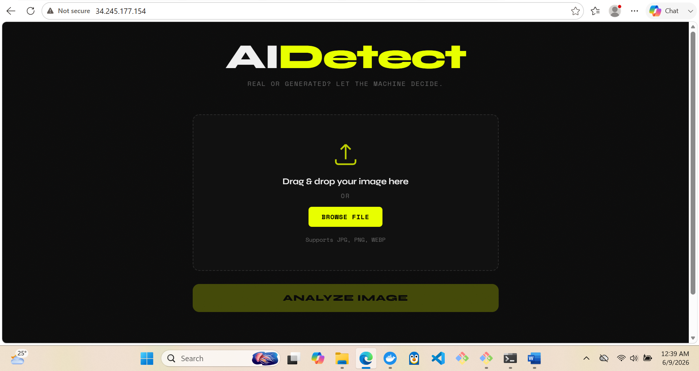
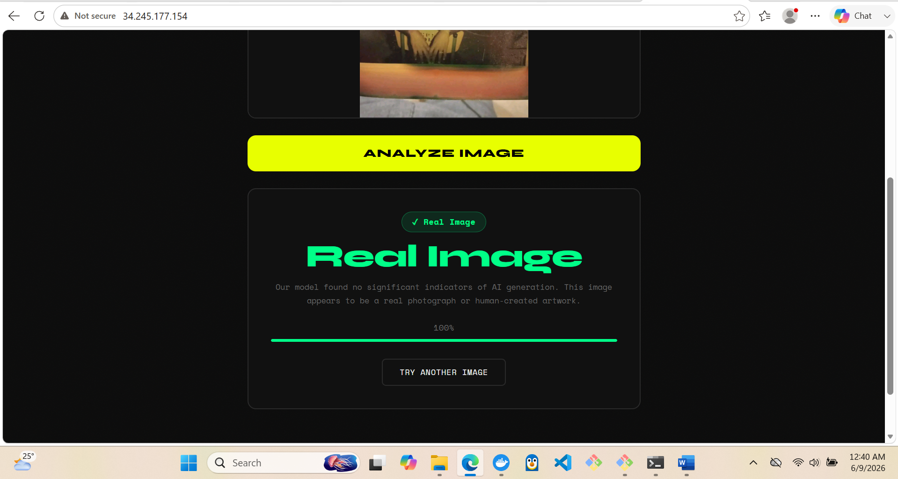
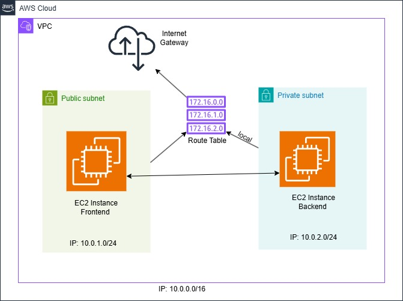
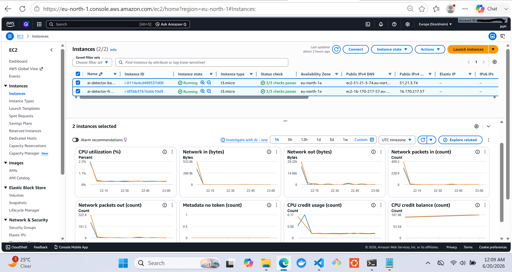
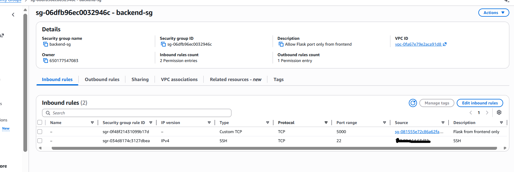
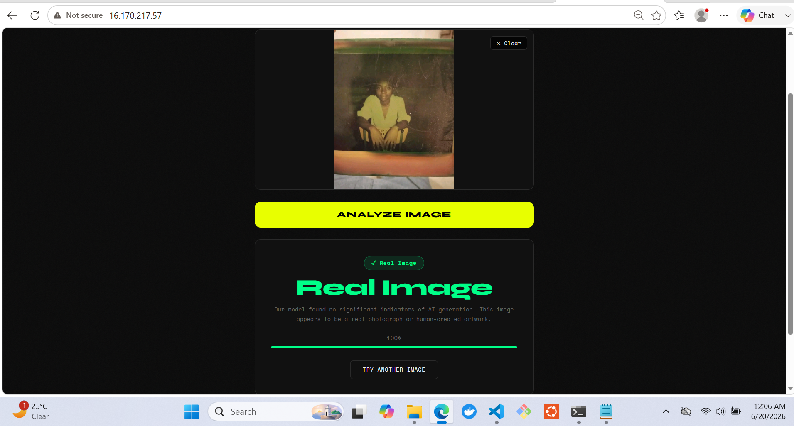

# 🔍 AI Image Authenticity Detector
## Phase 1: Manual Console Configuration / 9-06-2026


### Note:
make sure to edit: 
```
[all:vars]
backend_url=http://[use backend private ip]:5000
```
and
```
variable "my_ip" {
    description = "Your IP address for SSH access, in CIDR format"
    default     = "[your ip address]/32"
}

```
from the inventory.ini and variables.tf files respectively.

> A full-stack, cloud-deployed AI application that detects whether an image is **AI-generated** or a **real photograph** — built from scratch as a hands-on cloud project.

---
> 📸 ### Screenshots of the manual deployment...
> 
> 
> 
> 
---


## 📌 Table of Contents

- [Overview](#overview)
- [Live Demo](#live-demo)
- [Architecture](#architecture)
- [Tech Stack](#tech-stack)
- [How It Works](#how-it-works)
- [Project Structure](#project-structure)
- [Local Development](#local-development)
- [Docker Deployment](#docker-deployment)
- [AWS Deployment](#aws-deployment)
- [Challenges & Solutions](#challenges--solutions)
- [Lessons Learned](#lessons-learned)
- [What's Next](#whats-next)

---

## Overview

AiDetect is an end-to-end AI-powered web application that classifies images as either **AI-generated** or **real**. Users can drag and drop or browse for an image, and the app returns a prediction with a confidence score in seconds.

This project was built primarily as a learning exercise to gain hands-on experience with:
- Machine learning model deployment
- REST API design with Flask
- Docker containerization
- AWS cloud infrastructure (EC2, VPC, Security Groups)
- Nginx reverse proxy configuration

The model used is [SMOGY AI Image Detector](https://huggingface.co/Smogy/SMOGY-Ai-images-detector) from HuggingFace — a Vision Transformer (ViT) fine-tuned on over 50,000 real and AI-generated images.

---


---

## Architecture

> 📸 ### Diagram of the VPC architecture I designed
> 

The application runs on two separate EC2 instances inside a custom AWS VPC:

```
Internet
    ↓
Frontend EC2 (Public Subnet)
├── Nginx serving HTML/CSS/JS
└── Reverse proxy forwarding /image requests to backend
    ↓
Backend EC2 (Public Subnet — security group restricted)
├── Flask REST API
└── ML model running inference
    ↓
JSON prediction response back to user
```

**Security design:**
- The backend EC2 has a public IP but its security group only allows traffic on port 5000 from the frontend security group — effectively making it private to the outside world
- Port 22 (SSH) on both instances is restricted to the developer's IP only
- The frontend is the only entry point accessible to the public on port 80

---

## Tech Stack

| Layer | Technology |
|---|---|
| ML Model | HuggingFace Transformers, PyTorch (CPU) |
| Backend | Python, Flask, Flask-CORS, Pillow |
| Frontend | HTML, CSS, Vanilla JavaScript |
| Web Server | Nginx (Alpine) |
| Containerization | Docker |
| Cloud | AWS EC2, VPC, Security Groups |
| Registry | Docker Hub |

---

## How It Works

1. User visits the frontend and uploads an image via drag & drop or file browser
2. JavaScript sends the image as `multipart/form-data` via a `POST` request to `/image`
3. Nginx receives the request and reverse proxies it to the Flask backend
4. Flask extracts the image, converts it to a PIL Image object and passes it to the model pipeline
5. The HuggingFace pipeline runs inference and returns a label (`artificial` or `human`) with a confidence score
6. Flask returns a JSON response: `{ "label": "artificial", "confidence": 94.23 }`
7. JavaScript reads the response and updates the UI with the result and an animated confidence bar

---

## Project Structure

```
image_prediction/
│
├── backend/
│   ├── model/
│   │   └── smogy/              ← downloaded model weights
│   ├── predictor.py            ← Flask app and prediction logic
│   ├── requirements.txt        ← Python dependencies
│   └── Dockerfile              ← backend container definition
│
├── frontend/
│   ├── index.html              ← main page
│   ├── style.css               ← styling
│   ├── script.js               ← frontend logic and API calls
│   ├── default.conf.template   ← Nginx config with envsubst
│   └── Dockerfile              ← frontend container definition
│
└── README.md
```

---

## Local Development

### Prerequisites
- Python 3.11
- Docker Desktop
- Visual C++ Redistributable (Windows)

### Run the backend locally

```bash
cd backend
pip install torch torchvision torchaudio --index-url https://download.pytorch.org/whl/cpu
pip install -r requirements.txt
python predictor.py
```

Backend will be available at `http://localhost:5000`

### Run the frontend locally

Open `frontend/index.html` directly in your browser or serve it with Python:

```bash
cd frontend
python -m http.server 3000
```

Visit `http://localhost:3000`

---

## Docker Deployment

### Backend

```bash
cd backend
docker build -t ai-image-detector .
docker run -d -p 5000:5000 ai-image-detector
```

### Frontend

```bash
cd frontend
docker build -t ai-detector-frontend .
docker run -d -p 8080:80 -e BACKEND_URL="http://host.docker.internal:5000" ai-detector-frontend
```

Visit `http://localhost:8080`

### Docker Hub Images

```bash
# Pull from Docker Hub
docker pull jephjob/ai-image-detector
docker pull jephjob/my-frontend
```

---

## AWS Deployment

### Infrastructure Overview

- **VPC:** Custom VPC with public and private subnets (`10.0.0.0/16`)
- **Frontend EC2:** t3.micro, public subnet, Nginx + Docker
- **Backend EC2:** t3.micro, public subnet, Flask + Docker (restricted by security group)

### Security Groups

**Frontend SG:**
| Port | Protocol | Source |
|------|----------|--------|
| 80 | HTTP | 0.0.0.0/0 |
| 22 | SSH | My IP |

**Backend SG:**
| Port | Protocol | Source |
|------|----------|--------|
| 5000 | TCP | Frontend Security Group |
| 22 | SSH | My IP |

### Deployment Steps

**1. Launch two EC2 instances** (Amazon Linux 2023, t3.micro) inside your VPC

**2. Install Docker on both instances:**

```bash
sudo yum update -y
sudo yum install docker -y
sudo systemctl start docker
sudo systemctl enable docker
sudo usermod -aG docker ec2-user
```

**3. On the backend EC2 — pull and run:**

```bash
docker pull jephjob/ai-image-detector
docker run -d -p 5000:5000 jephjob/ai-image-detector
```

**4. On the frontend EC2 — pull and run:**

```bash
docker pull jephjob/my-frontend
docker run -d -p 80:80 -e BACKEND_URL="http://[backend-private-ip]:5000" jephjob/my-frontend
```

**5.** Visit `http://[frontend-public-ip]` in your browser

---

## Challenges & Solutions

### 1. DLL Initialization Error on Windows (WinError 1114)

**Problem:** After installing PyTorch on Windows, importing `transformers` threw a DLL initialization error related to `c10.dll`.

**Root Cause:** Missing Visual C++ Redistributable on the system. PyTorch's core DLL files depend on it.

**Solution:** Downloaded and installed the latest Microsoft Visual C++ Redistributable from the official Microsoft website. The import worked immediately after.

**Lesson:** On Windows, PyTorch has a hidden system dependency that isn't mentioned in the standard installation docs. Always check Visual C++ Redistributable when hitting DLL errors with Python scientific packages.

---

### 2. Private Subnet — No Internet Access for Docker Pull

**Problem:** The backend EC2 was initially deployed in a **private subnet** for security. However when attempting to install Docker and pull the backend image from Docker Hub, all outbound internet requests failed. The private subnet had no route to the internet because no NAT Gateway was configured.

**What a NAT Gateway does:** A NAT Gateway allows instances in a private subnet to initiate outbound connections to the internet (for things like downloading packages or pulling Docker images) while remaining unreachable from the internet directly. It's the standard AWS solution for this problem — but it costs money (~$0.045/hour).

**Options considered:**
1. Add a NAT Gateway — rejected due to cost
2. Temporarily move the instance to the public subnet to install dependencies, then move back — rejected because AWS does not allow changing the subnet of a launched EC2 instance
3. Redeploy the backend in the public subnet but restrict access using security groups only

**Solution chosen:** Terminated the private subnet backend EC2 and relaunched it in the **public subnet**. Access control was handled entirely through security groups — the backend security group only allows traffic on port 5000 from the frontend security group. No other source can reach the backend, effectively replicating the security benefit of a private subnet without the NAT Gateway cost.

**Lesson:** In real production environments a NAT Gateway or VPC endpoint is the correct solution. For learning and low-cost deployments, security groups alone can provide sufficient access control. Understanding *why* the private subnet failed and *what* a NAT Gateway does is more valuable than just clicking through the AWS console.

---

### 3. Docker Container Networking — localhost Confusion

**Problem:** When running the frontend and backend as separate Docker containers locally, setting `BACKEND_URL=http://localhost:5000` caused a 502 Bad Gateway error.

**Root Cause:** Inside a Docker container, `localhost` refers to the container itself — not the host machine or other containers. The frontend container was trying to reach port 5000 inside itself, where nothing was running.

**Solution:** Used `host.docker.internal` — a special Docker Desktop hostname that always resolves to the host machine from inside a container. On AWS EC2 this problem doesn't exist because the two EC2 instances communicate using real private IP addresses on the same VPC network.

---

### 4. Nginx File Size Limit (413 Request Entity Too Large)

**Problem:** Some larger images returned a 413 error even though the JavaScript file validation allowed them through.

**Root Cause:** Nginx has a default `client_max_body_size` of 1MB. Images larger than 1MB were being rejected by Nginx before even reaching Flask.

**Solution:** Added `client_max_body_size 10M` to the Nginx config to match the 10MB limit already set in the JavaScript validation. This created consistent validation at both layers.

---

## Lessons Learned

- **Simple architecture first.** The initial plan involved Lambda, S3 and API Gateway. After understanding the requirements better, a simpler two-EC2 architecture was chosen. Simpler was faster, cheaper and easier to debug.
- **Docker solves the "works on my machine" problem.** The same containers that ran locally ran identically on EC2 with zero configuration changes.
- **Security groups are powerful.** You don't always need a private subnet to secure a backend. Properly configured security groups can provide the same protection at lower cost and complexity.
- **Load the model once.** ML models should be loaded at application startup and kept in memory — not reloaded on every request. This is fundamental to performant model serving.
- **Nginx is not just a file server.** Using Nginx as a reverse proxy meant the backend URL never appeared in client-side JavaScript — a cleaner and more secure architecture.

---

## What's Next

- [ ] Redeploy infrastructure using IaC


---

---
# Phase 2: Project redeployment using IaC / 20-06-2026
## Overview
Phase 1 of this project involved manually clicking through the AWS console to provision a VPC, subnets, security groups, and two EC2 instances, then SSHing in by hand to install Docker and run containers.

Phase 2 replaces every manual step with code:

- **Terraform** provisions all AWS infrastructure — VPC, subnets, route tables, security groups, EC2 instances, and even generates and saves the SSH key pair
- **Ansible** connects to the provisioned servers and automatically installs Docker, pulls the correct Docker images, and runs the frontend and backend containers

---


---
> 📸 ### Screenshots of the IaC deployment...
> 
> 
> 
> 
---

---

## Tech Stack

| Layer | Technology |
|---|---|
| Infrastructure provisioning | Terraform |
| Configuration management | Ansible |
| Key generation | Terraform `tls` provider |
| Cloud | AWS (VPC, EC2, Security Groups, IGW) |
| Containers | Docker (pulled from Docker Hub) |

---

## Project Structure

```
infrastructure/
├── main.tf           ← all AWS resources (VPC, subnets, SGs, EC2, key pair)
├── variables.tf       ← input variables (region, CIDR blocks, instance type, IP)
├── outputs.tf          ← prints IPs/DNS names after apply
└── id_rsa.pem          ← auto-generated SSH key (gitignored)

ansible/
├── inventory.ini       ← target hosts, SSH details, backend_url variable
└── deploy.yml          ← installs Docker, pulls images, runs containers
```

---

---

## How to Deploy

**Prerequisites:**
- AWS CLI installed and configured (`aws configure`)
- Terraform installed
- Ansible installed
- An existing AWS account with an IAM user that has EC2/VPC permissions

**Steps:**

```bash
# 1. Provision infrastructure
cd infrastructure
terraform init
terraform plan
terraform apply

# 2. Note the outputs (IPs) printed at the end of apply,
#    update ansible/inventory.ini with the current IPs

# 3. Configure the servers
cd ../ansible
ansible -i inventory.ini all -m ping     # sanity check connectivity first
ansible-playbook -i inventory.ini deploy.yml

# 4. Visit the frontend's public IP in your browser
```

**To tear everything down:**

```bash
cd infrastructure
terraform destroy
```

---

### 504 Gateway Timeout — the deepest debugging chain of the project

**Problem:** After full deployment, the frontend loaded correctly, but submitting an image for analysis returned `504 Gateway Timeout`.

**Diagnosis process (in order, each step ruling out one layer):**

1. Checked the Nginx config inside the running container (`docker exec ... cat /etc/nginx/conf.d/default.conf`) — confirmed `proxy_pass` was pointing to the correct backend IP and port, with no malformed trailing path.
2. Tested the backend directly with `curl http://localhost:5000` **from the backend server itself** — got a `404`, which actually confirmed Flask was healthy and responding instantly (just hit the wrong route, `/` instead of `/image`).
3. Tested the same `/image` route directly **from the frontend server to the backend's public IP** — this hung indefinitely with no response, isolating the problem to the network path between the two servers rather than Nginx or Flask.
4. Re-verified the security group rule's content (port, protocol, source) — correct.
5. Cross-checked the actual security group **attached to each running instance** in the AWS console (not just the rule definitions) against each other — IDs matched exactly, ruling out a stale/mismatched attachment.
6. As a final isolation test, tried reaching the backend from the frontend using its **private IP** instead of its public IP — this connected instantly and correctly.

**Root cause:** Routing traffic between two instances in the same VPC via their **public IPs** sends that traffic out through the Internet Gateway and back in, rather than staying on the VPC's internal network. This round-trip path behaved inconsistently and ultimately hung, even though security groups technically permitted it.

**Solution:** Updated the backend URL used by the frontend (`inventory.ini` → `backend_url`) to use the backend's **private IP** instead of its public IP. Since this value is injected into the running container via `envsubst` at container startup, the frontend container also had to be explicitly recreated (`recreate: yes` in the Ansible `docker_container` task) for the change to take effect — simply re-running the playbook wasn't enough, since Ansible considered the already-running container "unchanged."

**Lesson:** Instances within the same VPC should always communicate using **private IPs**. Public IPs are for traffic originating outside the VPC. This is a fundamental AWS networking principle that manual, single-instance deployments often never surface — it only became visible once Nginx, Flask, and security groups were all already confirmed correct, forcing a closer look at the network path itself.

---


## Author

Built by **Jephthah Job** as a hands-on cloud and portfolio project.

- GitHub: [github.com/jeph-job](https://github.com/jeph-job)
- Docker Hub: [hub.docker.com/u/jephjob](https://hub.docker.com/u/jephjob)

---

> *"The best way to learn cloud is to break things, fix them, and document why they broke."*
